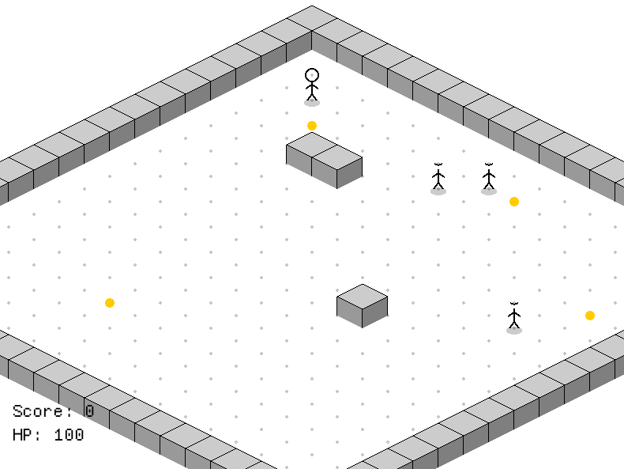

# 🦀 Crablo

Um dungeon crawler isométrico minimalista feito em Rust, onde você controla um stickman numa masmorra tile-based com pathfinding, combate e coleta de ouro.

## Screenshot



## Como funciona

- O **mapa** é uma grade 20×20 renderizada em perspectiva isométrica com tiles de parede e chão.
- O **jogador** é movido com clique esquerdo do mouse — o jogo calcula o caminho automaticamente via **BFS (Breadth-First Search)**.
- **Monstros** perseguem o jogador usando o mesmo algoritmo de pathfinding e atacam ao ficarem adjacentes.
- **Ouro** espalhado pelo mapa pode ser coletado ao passar por cima.
- **Textos flutuantes** exibem dano recebido (vermelho) e ouro coletado (verde).
- O jogo termina em **vitória** (matar todos os monstros) ou **derrota** (HP chega a zero).

## Mecânicas

| Ação              | Como fazer                         |
| ----------------- | ---------------------------------- |
| Mover jogador     | Clique esquerdo no tile de destino |
| Atacar monstro    | Clique esquerdo no monstro         |
| Coletar ouro      | Mover para o tile com ouro         |
| Iniciar/reiniciar | Pressionar `Enter`                 |

### Pontuação

- **+100** por moeda coletada
- **+50** por monstro eliminado

## Tecnologias

- **Rust** (edition 2024)
- **[macroquad](https://macroquad.rs/)** — framework de jogos 2D para Rust, simples e multiplataforma

## Como rodar

### Pré-requisitos

- [Rust](https://rustup.rs/) instalado (`rustup` + `cargo`)

### Instalação e execução

```bash
git clone https://github.com/warubert/crablo.git
cd crablo
cargo run
```

Para build otimizado:

```bash
cargo run --release
```

## Estrutura do código

```
src/
├── main.rs       # Entry point, AppState e loop principal
├── game.rs       # Struct Game — estado, lógica de update e draw
├── map.rs        # Tile, constantes, coordenadas isométricas, BFS e draw_walls
├── entities.rs   # Structs Monster e DmgText
└── renderer.rs   # draw_stickman (herói e monstros)
```

### Principais componentes

- **`Game`** (`game.rs`) — estado central do jogo (mapa, jogador, monstros, ouro, score)
- **`bfs()`** (`map.rs`) — algoritmo de pathfinding BFS usado pelo jogador e pelos monstros
- **`to_screen()` / `to_tile()`** (`map.rs`) — conversão entre coordenadas de tile e coordenadas de tela (projeção isométrica)
- **`draw_stickman()`** (`renderer.rs`) — renderiza o herói e os monstros com linhas simples
- **`draw_walls()`** (`map.rs`) — renderiza tiles de parede com faces 3D usando triângulos
- **`DmgText`** (`entities.rs`) — textos animados flutuantes para feedback visual de dano e ouro

## Estados do jogo

```
Menu → Playing → GameOver → Menu
```
